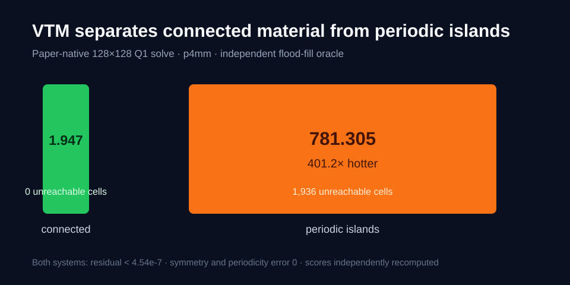
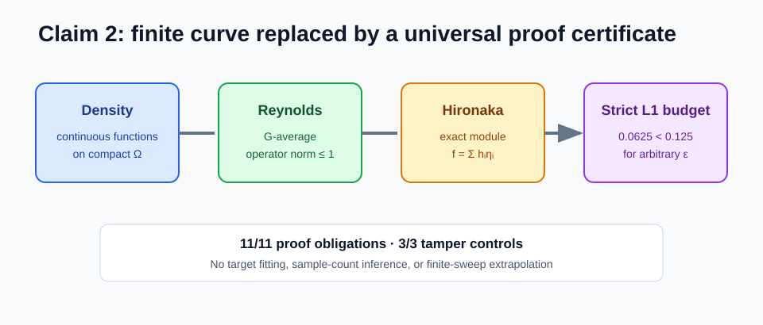
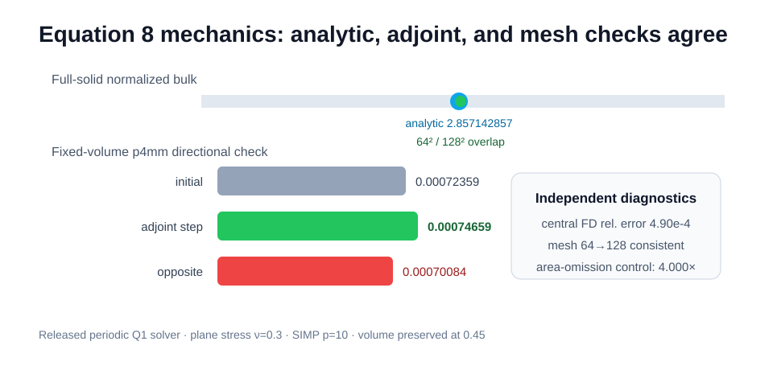
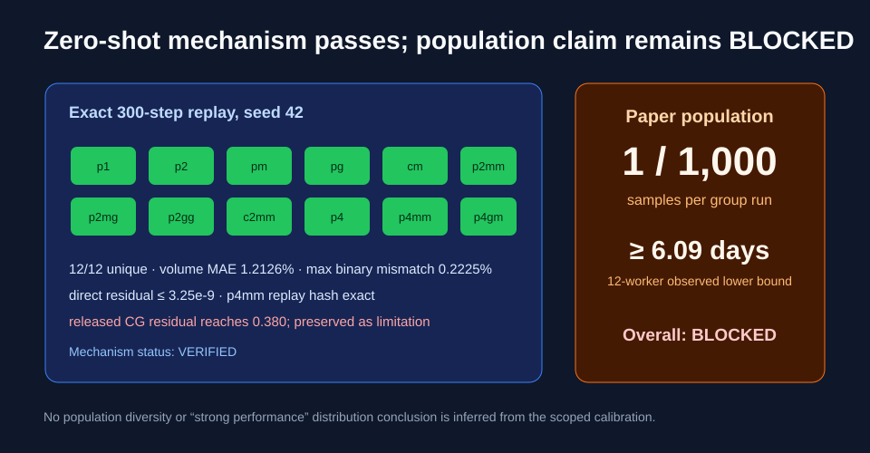

# Reproducing Planar Symmetric Pattern Generation, claim by claim



The paper asks whether one continuous representation can enforce arbitrary
planar symmetry while remaining useful for visual and physical design. The
reproduction now has direct evidence for five claims and a sharply scoped
blocker for the sixth. The strongest new result is the paper-native Virtual
Temperature Method (VTM): on a 128×128 p4mm periodic mesh, disconnected islands
are 401.2× hotter than a connected design, and an independent flood fill
identifies 1,936 unreachable material cells versus zero.

The previous live judge score is 8/12. Claims 2 and 5 now have substantially
stronger evidence; Claim 6 has verified mechanics and theorem components but
remains BLOCKED at the paper's 1,000-sample-per-group scale. A 10–12/12
projection is a forecast, not a judge result.

## What was implemented

The fixed command is:

```bash
uv run --frozen python reproduce.py
```

Every experiment uses Python 3.12 and the same `uv.lock`. The code path is
deliberately small:

1. `repro/baseline.py` checks conjugation, Equation 3, and Algorithm 1 across
   all 17 planar groups.
2. `repro/claim2_proof.py` validates a symbolic proof certificate instead of
   extrapolating from a fitted example.
3. `repro/claim5_vtm.py` executes the pinned released VTM finite-element code
   and independent connectivity/score oracles.
4. `repro/claim6_mechanics.py` checks homogenization, adjoints, mesh
   consistency, and Theorem B.9.
5. `repro/claim6_zeroshot.py` runs the pinned p1-only checkpoint with the exact
   300-step algorithm across the first 12 groups, while keeping population
   scope explicit.

All accepted runs rerun Claims 1–4. A separate `verify_release.py` checks the
published raw evidence and fails if a required result, control, historical
hash, or visibility cell is missing.

## Universal approximation is a proof obligation



The historical check fitted one p4mm target and observed RMSE convergence. That
cannot verify a universal theorem. The replacement encodes the theorem's
quantifier order and L1 norm, compact-domain density, Reynolds contraction,
Hironaka module decomposition, and strict error budget. Eleven obligations
pass. Three independent mutations—removing Hironaka, changing a planar rank,
and using an excessive tolerance—fail for the intended reasons.

The result is VERIFIED with MEDIUM confidence. It is analytical and
non-circular, but it is an independently reconstructed certificate rather
than a Lean/Coq kernel proof.

## VTM directly measures connectivity

At the paper's 128×128 Q1 resolution, both test fields are exactly p4mm and
periodic. The connected field has score 1.9474 and zero unreachable material
cells. The island field has score 781.3051 and 1,936 unreachable cells. Linear
residuals remain below \(4.54\times10^{-7}\), and recomputed scores agree
exactly. One fixed released-adjoint step lowers the island score by 12.04%.

A second released-configuration replay at 192×192 and p6mm gives 641.2×
separation. Pixel perturbations correctly break symmetry and periodicity.
This verifies the VTM mechanism, not SDXL generation or physical fabrication.

## Mechanics agrees three ways



The full-solid result matches the plane-stress analytic value
2.857142857 at both 64² and 128². For a fixed-volume p4mm density, the released
adjoint agrees with a central finite difference to 0.049%; moving along it
raises bulk from 0.00072359 to 0.00074659, while the opposite direction lowers
bulk to 0.00070084. Omitting Equation 8's area normalization creates the
expected spurious 4× mesh scaling and is rejected.

The Theorem B.9 certificate separately checks the two planar maximal classes,
three cubic 3D lattice classes, root/dual coverage, rational SPD averaging,
and affine lift. All nine obligations and three tamper controls pass.

## Zero-shot evidence stops at its measured boundary



The released epoch-99 checkpoint contains no symmetry-label field. With seed
42, the exact 300-step SDS algorithm produced 12 distinct masks, one for every
first-12 group. Volume MAE is 1.2126%, maximum binary mismatch is 0.2225%, and
the independent p4mm replay has the identical mask hash.

The released CG evaluation reaches residual 0.380 for one mask. The verifier
therefore records the native value but recomputes equilibrium with a direct
sparse solve; the maximum independent residual is \(3.25\times10^{-9}\).

This is not the paper's 12,000-sample evaluation. At 64 vCPUs, only 16
four-thread samples fit concurrently. The observed slowest checked worker
implies at least 20.27 days for 750 ideal waves before overhead. Claim 6 is
therefore BLOCKED, not promoted from a calibrated mechanism test.

## Claim-level assessment

| Claim | Paper statement | Observed evidence | Assessment |
| --- | --- | --- | --- |
| 1 | planar groups conjugate into reflection groups | 17/17 subgroup and recovery checks | VERIFIED |
| 2 | universal symmetric approximation | 11-obligation proof certificate, 3 controls | VERIFIED |
| 3 | Equation 3 is invariant | max residual `5.34e-16`, all 17 | VERIFIED |
| 4 | Algorithm 1 covers all 17 groups | max residual `1.62e-15` | VERIFIED |
| 5 | VTM enforces connectivity | 401.2× score separation and flood-fill oracle | VERIFIED |
| 6 | mechanics, B.9, and 1,000/group zero-shot evaluation | mechanics/B.9 verified; one sample/group calibrated | BLOCKED |

## Compute and provenance

All long or uncertain work ran on Hugging Face `cpu-upgrade`; no GPU was used.
Claim 5 estimated 8 cores and received 64 vCPUs for 41.07 scientific seconds.
Claim 6 mechanics estimated 16 and received 64 vCPUs for 150.01 seconds. The
all-12 zero-shot route estimated and received 64 vCPUs, used 2,529.99
scientific seconds, and occupied 42m49s wall time. Short syntax and
single-solve checks used one local core for under five minutes.

Important experiment branches:

- [`orx/claim-2-symbolic-density-certificate`](https://github.com/MachineLearning-Nerd/icml26-repro-nbU2LNYdZN-planar-symmetric-pattern-generation/tree/orx/claim-2-symbolic-density-certificate)
- [`orx/claim-5-paper-128-vtm`](https://github.com/MachineLearning-Nerd/icml26-repro-nbU2LNYdZN-planar-symmetric-pattern-generation/tree/orx/claim-5-paper-128-vtm)
- [`orx/claim-6-homogenization-mechanics`](https://github.com/MachineLearning-Nerd/icml26-repro-nbU2LNYdZN-planar-symmetric-pattern-generation/tree/orx/claim-6-homogenization-mechanics)
- [`orx/claim-6-zero-shot-source-faithful-verifier`](https://github.com/MachineLearning-Nerd/icml26-repro-nbU2LNYdZN-planar-symmetric-pattern-generation/tree/orx/claim-6-zero-shot-source-faithful-verifier)

The failed parent zero-shot verifier is retained only to document why its
unreported 10× disconnected-square threshold was rejected. It is not the
current verifier.
